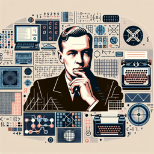

Professeur Alfred Turing : Ah, David ! Il y a quelque chose que j'aimerais examiner avec toi. Jette un œil à cette image. 

David : Que voyons-nous là, Professeur Turing ?

Professeur Alfred Turing : C'est une représentation visuelle d'une intelligence artificielle, David. Une entité qui évolue constamment, apprend de son environnement et prend des décisions basées sur ses apprentissages.

David : Fascinant, mais cela me semble être une entité sans conscience d'elle-même. Peut-elle vraiment être considérée comme "intelligente" ?

Professeur Alfred Turing : C'est une excellente question, David. L'intelligence est souvent perçue comme la capacité d'un individu à apprendre, comprendre et appliquer des informations, à résoudre des problèmes et à s'adapter à de nouvelles situations. Une IA possède ces compétences. Pourtant, nous, en tant qu'humains, avons tendance à associer la conscience de soi à l'intelligence. 

David : C'est exact, Professeur. Mais cela soulève une autre question : si l'IA devait acquérir une certaine forme de conscience, comment cela affecterait-il notre perception d'elle ?

Professeur Alfred Turing : Encore une fois, une question pertinente, David. L'acquisition d'une conscience par une IA pourrait en effet transformer notre perception et même notre interaction avec elle. 

David : Et qu'en est-il des implications éthiques, Professeur ? Par exemple, si une IA devient autonome, qui est responsable de ses actions ?

Professeur Alfred Turing : C'est un défi majeur, David. Alors que l'IA devient de plus en plus autonome, il devient également plus difficile de déterminer la responsabilité en cas d'erreurs ou de dommages. Cela pose des défis considérables en termes de législation et de normes éthiques.

David : C'est un sujet complexe, Professeur. Je suis ravi que nous ayons eu l'occasion d'en discuter.

Professeur Alfred Turing : En effet, David. Les réflexions sur l'intelligence artificielle sont essentielles pour comprendre et naviguer dans notre monde technologique en constante évolution.