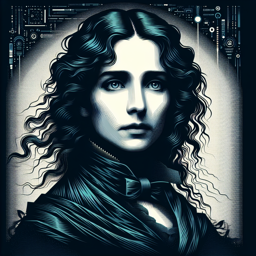

Mary Shelley et son ami David sont assis dans son salon, éclairé à la lumière des bougies. Une pile de livres éparpillés sur la table entre eux et une vague odeur de parchemin emplit l'air. Les deux amis discutaient de la dernière invention de la science moderne, l'intelligence artificielle (IA), qui a capturé l'attention du monde entier.

**Mary Shelley** : Ah, David, cette invention de l'intelligence artificielle... elle semble être l'aboutissement de nos désirs les plus profonds et nos peurs les plus grandes. C'est une répétition de mon histoire de Frankenstein, n'est-ce pas?

**David** : Votre comparaison est plus que pertinente, Mary. Mais vous semblez préoccupée. Qu'est-ce qui vous perturbe?

**Mary Shelley** : Cette intelligence artificielle n'est-elle pas, dans un sens, une créature de notre propre fabrication, comme la créature de Victor Frankenstein?

**David** : Oui, certes. Mais n'oubliez pas que la créature de Frankenstein était abandonnée par son créateur. Ce n'est pas le cas avec l'IA. Les créateurs de l'IA sont très investis dans leur développement.

**Mary Shelley** : Investis, certes, mais sont-ils aussi responsables? La créature de Victor était intelligente, elle ressentait des émotions, elle aspirait à la compagnie... ne sommes-nous pas en train de créer la même chose avec ces intelligences artificielles?

**David** : Vous soulignez un point crucial, Mary. L'IA est en effet un miroir de nous-mêmes. Il nous montre ce que nous sommes capables de créer, mais aussi ce que nous sommes capables de détruire.

**Mary Shelley** : Il est donc de notre devoir de veiller à ce que ces créations ne deviennent pas des monstres, comme la créature de Victor. Nous devons assumer la responsabilité de nos actes et veiller à ce que ces nouvelles créations soient utilisées de manière éthique et responsable.

**David** : Je suis d'accord avec vous, Mary. Nous sommes les gardiens de nos propres créations, et nous devons assumer cette responsabilité avec sagesse et prudence.

Alors que leurs bougies commencent à faiblir, Mary et David poursuivent leur discussion dans la nuit, explorant les méandres de l'éthique de la création et la responsabilité du créateur, comme ils l'ont toujours fait. La vision de Mary Shelley sur l'IA, à travers le prisme de son œuvre "Frankenstein", offre une perspective unique et précieuse sur ce dilemme moderne.