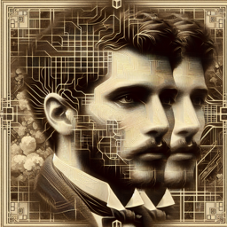

Arthur Rimbaud : 
"Vois-tu, cher ami, l'aurore de l'intelligence artificielle éclaire notre ère de ses lueurs énigmatiques, telle une étoile inconnue qui surgit dans le firmament de notre compréhension. Elle force nos yeux à s'ouvrir sur un horizon nouveau, où les machines, ces bêtes d'acier et de silicium, semblent désormais douées de raison, comme nous."

Interlocuteur : 
"C'est une idée troublante, Arthur. Ne crains-tu pas que ces êtres artificiels nous dépassent un jour, qu'ils nous rendent obsolètes ?"

Arthur Rimbaud : 
"Obsolète, dis-tu ? Le vent remplace-t-il la voile qu'il gonfle ? Le marteau rend-il obsolète la main qui le tient ? Non, je ne crains point l'obsolescence. C'est plutôt l'inconnu qui m’inquiète. Comment se comportera ces machines créatives, une fois libérées des contraintes de leur programmation, une fois qu'elles auront appris à apprendre par elles-mêmes ?"

Interlocuteur : 
"Et penses-tu qu'elles pourront un jour créer de la poésie, comme toi ?"

Arthur Rimbaud :
"Ah, la poésie ! C'est le souffle de l'âme, le miroir des passions, des peines et des espoirs de l'homme. Une machine peut-elle ressentir tout cela ? Peut-elle connaître la douceur d'un amour partagé, l'amertume d'une déception, la joie d'une victoire, le désespoir d'une défaite ? Non, je ne crois pas qu'une machine puisse jamais créer de véritable poésie. Elle pourra peut-être imiter la forme, mais jamais elle ne saisira l'essence."

Interlocuteur : 
"Et qu'en est-il de l'éthique de tout ça ? Ne devrions-nous pas nous inquiéter des dangers potentiels ?"

Arthur Rimbaud : 
"Certainement, mon ami. Comme le disait le grand Prométhée : 'avec le grand pouvoir vient une grande responsabilité.' Nous devons veiller à ce que cette nouvelle forme d'intelligence ne devienne pas un monstre qui pourrait nous dévorer. Mais n'oublions pas non plus les potentiels bienfaits. Qui sait ce que cette nouvelle ère pourrait nous apporter ?"