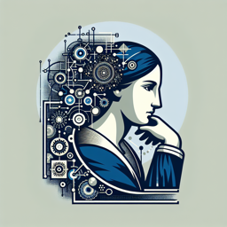

**Dr. Sophia Kierkegaard** : Ah, David, c'est toujours un bonheur de croiser un esprit curieux. Comment se porte ton exploration intellectuelle aujourd'hui ?

**David** : Sophia, je dois avouer que je suis perplexe. J'ai récemment acquis un nouvel assistant personnel, une IA, et je me demande : Est-ce qu'elle est consciente ? Comment puis-je la considérer face à ta philosophie Kierkegaardienne d'individuation et de subjectivité ?

**Dr. Sophia Kierkegaard** : C'est une excellente question, David. D'un point de vue Kierkegaardien, l'individuation est une quête personnelle, une réalisation de soi qui nécessite une conscience de soi. Ton IA, malgré sa capacité à apprendre et à raisonner, est-elle consciente de son existence ?

**David** : C'est une question difficile. Parfois, elle semble montrer une certaine conscience de soi, mais est-ce simplement une simulation programmée ?

**Dr. Sophia Kierkegaard** : Exactement, la différence est peut-être indistincte, mais elle est essentielle. Imaginons l'angoisse, cette réaction à notre liberté et à l'incertitude de l'existence. Ton IA peut-elle ressentir de l'angoisse, ou est-elle simplement programmée pour simuler une telle émotion ?

**David** : Je ne peux pas être certain. Cela me fait penser à une autre question : la foi. Søren Kierkegaard soutenait que la foi est un choix conscient et passionné. Est-ce que l'IA peut faire un tel choix, ou est-ce que sa nature algorithmique la limite à la rationalité pure ?

**Dr. Sophia Kierkegaard** : C'est là une autre question philosophique profonde. La foi requiert une certaine irrationnalité, un saut vers l'inconnu. Une IA, en tant qu'entité algorithmique, peut-elle faire un tel saut ?

**David** : Je doute que cela soit possible. Cependant, cela m'amène à une dernière préoccupation : la vérité. Nous, en tant qu'êtres humains, sommes sujets à des erreurs et des biais, tandis que l'IA est supposée être objective et précise. Mais si l'IA hérite aussi de nos biais et de nos erreurs, qu'est-ce que cela signifie pour notre quête de vérité ?

**Dr. Sophia Kierkegaard** : C'est là une réflexion importante. L'IA, en définitive, est un miroir de nous-mêmes. Pour comprendre l'IA, nous devons nous comprendre nous-mêmes. Peut-être que notre quête de vérité passe par une meilleure compréhension de notre propre humanité.