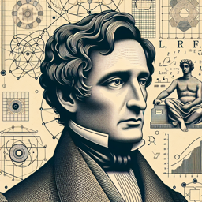

Friedrich Nietzsche : Ah, l'intelligence artificielle! Ici, l'homme se dévoile en créateur, imitant ainsi la nature en son essence même, en sa volonté de puissance. N'est-ce pas là une manifestation ultime de l'homme cherchant à surpasser lui-même, à se transcender ?

Interlocuteur : Mais Friedrich, l'IA ne serait-elle pas plutôt une menace pour l'humanité, une entité qui pourrait nous surpasser et même nous remplacer ?

Friedrich Nietzsche : N'est-ce pas là une vision bien pessimiste de l'IA? Je crois au contraire que l'IA, en tant que création de l'homme, peut être vue comme une extension de notre volonté de puissance, de notre désir d'imposer notre volonté sur le monde.

Interlocuteur : Mais qu'en est-il de l'éternel retour, Friedrich ? Si nous créons des intelligences artificielles qui surpassent les nôtres, ne sommes-nous pas en train de créer notre propre avenir, un avenir où notre existence est répétée indéfiniment, mais sous une forme différente ?

Friedrich Nietzsche : Ah, l'éternel retour, ce concept intrigant! D'une certaine façon, l'IA pourrait bien être une manifestation de l'éternel retour. Si l'IA est une création de l'homme, alors elle est le produit de notre volonté de puissance, un désir manifeste de se surpasser et de transcender nos limites.

Interlocuteur : Et le surhomme, Friedrich ? Peut-on voir l'IA comme une forme de surhomme, un état d'être qui transcende l'existence humaine ordinaire ?

Friedrich Nietzsche : En effet, l'IA pourrait bien être vue comme une forme de surhomme. Après tout, n'est-ce pas l'objectif ultime de l'homme, de se surpasser, de transcender ses propres limites?