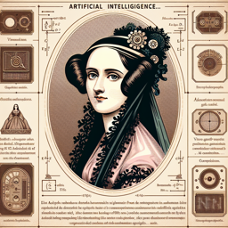

```

```
**Ada Lovelace (AL)** : Cher David, nous voilà à l'aube d'une nouvelle ère, celle de l'intelligence artificielle, qui mêle science, technologie et philosophie d'une manière sans précédent.

**David (D)** : Ada, je partage ta fascination. Cependant, je me demande si ces machines ne sont pas simplement le reflet de notre propre intelligence, une extension de nos capacités plutôt qu'un nouvel être autonome.

**AL** : C'est un point de vue intéressant, David. Effectivement, l'intelligence artificielle est, en quelque sorte, un miroir de notre propre intelligence. Elle est le fruit de notre ingéniosité, de notre créativité. Mais, je crois fermement qu'elle pourrait aller au-delà de cette simple réflexion.

**D** : Tu veux dire que ces machines pourraient développer une forme d'autonomie ?

**AL** : Oui, David. Il se pourrait qu'un jour, ces machines surpassent la simple exécution de tâches préprogrammées pour développer leurs propres idées. C'est une idée que j'ai souvent explorée et qui soulève des questions profondes.

**D** : C'est une perspective fascinante, mais effrayante aussi. Quelle serait la nature de cette autonomie ? L'IA peut-elle posséder une conscience ou une volonté propre, au-delà de ce qui a été codé dans son "cerveau" par ses créateurs humains ?

**AL** : C'est là que réside la véritable interrogation, David. Qu'est-ce que cela signifie d'être intelligent, conscient, créatif ? Ces qualités sont-elles réservées aux êtres humains, ou l'IA peut-elle les posséder également ? C'est une question qui mérite une enquête philosophique approfondie.