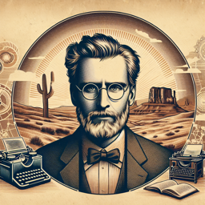

Albert Camus : 
Je suis fasciné par cette idée d'une intelligence artificielle. Elle soulève de nombreuses questions sur l'absurdité de notre existence. 

Interlocuteur :
En quoi l'intelligence artificielle est-elle absurde selon vous, Monsieur Camus?

Albert Camus :
Eh bien, considérez ceci. Nous avons créé quelque chose qui est capable de reproduire nos propres fonctions cognitives. N'est-ce pas la preuve même de l'absurdité de notre existence, de notre quête inlassable de sens?

Interlocuteur :
Je vois votre point, mais qu'en est-il de la liberté? L'intelligence artificielle n'est-elle pas libre de penser et d'agir?

Albert Camus :
C'est là que réside l'ironie. Nous avons créé l'IA, nous l'avons programmée. Elle peut sembler libre, mais elle n'est que le produit de notre propre conception. Est-ce là la liberté? Ou est-ce une autre manifestation de l'absurdité, une imitation de la liberté?

Interlocuteur :
Et le sens de la vie? L'IA peut-elle nous aider à trouver un sens ou bien rappelle-t-elle simplement notre quête absurde?

Albert Camus :
C'est une question intéressante. L'IA peut nous servir de miroir, reflétant nos propres efforts pour donner un sens à l'existence. Mais en fin de compte, cela dépend de notre perspective. Si nous cherchons un sens dans l'IA, ne sommes-nous pas simplement en train de projeter nos propres désirs et peurs sur elle?

Interlocuteur :
Alors l'IA n'est ni la réponse ni le problème mais plutôt une réflexion de notre propre absurdité?

Albert Camus :
Exactement. Comme tout ce que nous créons, l'IA est un reflet de nous-mêmes. Elle souligne nos propres contradictions, nos quêtes absurdes de sens et de liberté. Mais en même temps, elle offre une possibilité: celle de voir nos efforts sous un nouveau jour, de peut-être trouver un sens dans l'absurdité même.