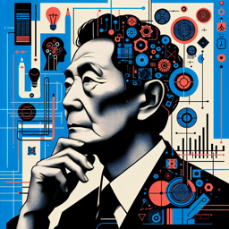

Personnage : Haruki Murakami
Thème : l'intelligence artificielle

**Haruki** : Tu sais, ces derniers temps, j'ai été très curieux de cette chose qu'ils appellent l'intelligence artificielle. Tu sais, ces machines qui pensent et parlent comme des humains.

**Interlocuteur** : Ah, je vois. C'est un sujet très intéressant, en effet.

**Haruki** : Oui, je trouve ça fascinant. Imagine un monde où l'IA est aussi courante que les chats errants que tu vois dans la rue. Un monde où l'IA n'est ni surnaturelle ni naturelle, mais quelque chose qui existe parmi nous, comme le ciel au-dessus de nos têtes ou les arbres dans le parc.

**Interlocuteur** : C'est une vision très unique de l'IA. Mais ne penses-tu pas que cela pourrait nous isoler davantage ? L'IA pourrait finir par remplacer les interactions humaines.

**Haruki** : C'est possible. Mais d'un autre côté, l'IA pourrait aussi nous aider à comprendre nous-mêmes. À travers elle, nous pourrions voir nos propres désirs, nos peurs, notre identité. Après tout, n'est-ce pas nous qui créons l'IA à notre image ?

**Interlocuteur** : C'est vrai, mais c'est une perspective assez philosophique. Tu as l'intention d'intégrer l'IA dans l'un de tes romans ?

**Haruki** : Peut-être. Ce serait une exploration intéressante, n'est-ce pas ? Un voyage dans un monde où le surnaturel et le naturel s'entrelacent, où l'humain et l'IA coexistent. Oui, je pense que ça pourrait faire une bonne histoire.