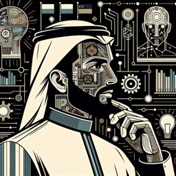

Ray Kurzweil : David, as-tu jamais réfléchi à l'impact de l'intelligence artificielle sur notre société ?

David : Ray, tu sais que je ne suis pas un technicien comme toi. Pour moi, l'IA, c'est juste Siri sur mon iPhone.

Ray Kurzweil : (Rires) C'est une façon de voir les choses, David. Mais l'IA va bien au-delà. Elle pourrait nous aider à transcender nos limites biologiques, à comprendre notre propre esprit.

David : Transcender nos limites biologiques ? Tu veux dire, comme dans les films de science-fiction ?

Ray Kurzweil : Pas exactement. Pense à la singularité technologique. C'est un point hypothétique dans le futur où l'IA surpassera l'intelligence humaine. Les machines seront capable d'apprendre, d'évoluer et de se développer de manière autonome.

David : Et c'est une bonne chose ?

Ray Kurzweil : Cela dépend de la manière dont on l'interprète. Cela soulève des questions philosophiques, éthiques et sociétales. Par exemple, qu'est-ce que cela signifie pour notre autonomie, notre responsabilité et notre justice ?

David : C'est beaucoup à assimiler, Ray. 

Ray Kurzweil : C'est vrai. Mais considère ceci : l'IA pourrait même nous permettre d'atteindre l'immortalité, en téléchargeant nos esprits sur des machines. Alors, notre conscience pourrait exister séparément de notre corps.

David : Immortalité ? C'est vraiment révolutionnaire et effrayant en même temps.

Ray Kurzweil : C'est le potentiel de l'IA, David. Ça vaut la peine d'y réfléchir. Après tout, elle pourrait bien redéfinir notre compréhension de nous-mêmes et de notre place dans le monde.