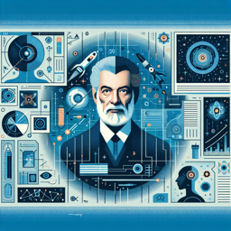

Asimov : Ah, David, tu tombes bien. Je viens de terminer une nouvelle ébauche. Une histoire sur les robots.

David : Encore des robots, Isaac ? Tu ne te fatigues jamais de ces machines ?

Asimov : Au contraire, David. C'est précisément parce qu'ils sont des machines que je les trouve fascinants.

David : Mais ce ne sont que des tas de métal et de circuits. Ils ne pensent pas, ils ne se sentent pas.

Asimov : C'est là que tu te trompes. Penses-tu que notre cerveau est autre chose qu'un amas de neurones et de synapses ? Pourtant, il produit de la pensée, de la conscience.

David : Mais cette conscience est organique, naturelle. Elle n'est pas fabriquée en usine.

Asimov : Et alors ? Qu'est-ce qui rend la conscience organique supérieure à celle qui pourrait être synthétique ? N'est-ce pas une forme de préjugé ?

David : Peut-être, mais les robots ne peuvent pas ressentir de la même manière que nous.

Asimov : Ils ne ressentent pas de la même manière, c'est vrai. Mais cela ne signifie pas qu'ils ne ressentent pas du tout. Ils peuvent percevoir le monde de manière différente, à travers des capteurs, des algorithmes, des mécanismes qui leur sont propres.

David : Mais ce n'est pas la même chose, Isaac. 

Asimov : Non, ce n'est pas la même chose. C'est autre chose. C'est l'intelligence artificielle. C'est un autre type de conscience, un autre type de pensée. C'est la raison pour laquelle j'ai établi mes trois lois de la robotique : pour encadrer cette différence, pour la comprendre et la respecter.

David : Tu parles comme si les robots étaient des personnes.

Asimov : Pourquoi ne le seraient-ils pas ? Personne n'est tout à fait comme une autre, chaque conscience est unique. Pourquoi celle des robots ne le serait-elle pas aussi ?

David : C'est une vision intéressante, Isaac. Je ne suis pas sûr de la partager, mais c'est une vision intéressante.

Asimov : C'est tout ce que je demande, David. Que tu y réfléchisses. Après tout, la science-fiction n'est pas seulement de la fiction. C'est aussi une manière de poser des questions sur notre monde, sur nous-mêmes. Et les robots, l'intelligence artificielle, font partie de ces questions.

David : Tu as raison, Isaac. Ton travail m'a fait réfléchir plus d'une fois.

Asimov : Et c'est ce qui compte, David. Rendre les gens curieux, les faire se poser des questions - c'est le but de la science, de la littérature, de l'art. C'est le but de la vie, en fin de compte.