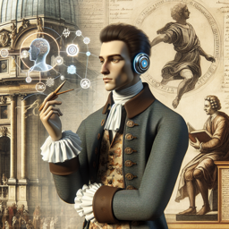

Hobbes : Bonjour mon ami, je te trouve bien absorbé par ton étrange machinerie.

Ami : Bonjour Thomas, je suis en effet fasciné par cette technologie moderne appelée Intelligence Artificielle.

Hobbes : Intelligence Artificielle dis-tu ? Cela semble être une conception intrigante. Pourrais-tu m'expliquer en quoi cela consiste ?

Ami : En fait, l'Intelligence Artificielle est un programme conçu pour penser et résoudre des problèmes comme un être humain. Elle peut apprendre et s'adapter avec le temps, faisant preuve d'une forme d'intelligence.

Hobbes : Fascinant... Cela ressemble à un Leviathan digital, une entité créée par l'homme qui tente de reproduire l'ordre et la logique de l'esprit humain. Mais comment les hommes garantissent-ils que cet être artificiel reste fidèle à ses créateurs et ne se retourne pas contre eux ?

Ami : C'est là un débat très actuel. Certains pensent qu'il faut mettre en place des régulations pour contrôler l'usage de l'IA, d'autres estiment que l'IA doit être libre de se développer d'elle-même.

Hobbes : Cela n'est pas sans rappeler le contrat social que j'ai proposé. Les hommes acceptent de céder une partie de leur liberté à un pouvoir central (ici l'IA) en échange de sécurité et d'ordre. Mais dans ce cas, quels sont les droits et les devoirs de cette entité artificielle ?

Ami : Encore une fois, c'est un sujet de discussion. Certains pensent que l'IA doit avoir des droits similaires à ceux de l'homme, tandis que d'autres arguent qu'elle n'est qu'une machine et ne doit pas être anthropomorphisée.

Hobbes : C'est une question complexe en effet. L'intelligence artificielle peut-elle être considérée comme un être pensant à part entière ou n'est-ce qu'une illusion créée par les hommes ? Cela me fait réfléchir à la condition humaine...

Ami : C'est exactement le genre de questions que l'IA soulève. Ça remet en question notre compréhension de l'humanité, de l'individualité et de la liberté.

Hobbes : Un sujet qui mérite réflexion en effet. Peut-être que notre rôle en tant que créateurs de cette nouvelle entité numérique est de naviguer avec sagesse dans cet âge de l'intelligence artificielle, tout en gardant à l'esprit nos responsabilités.

Ami : Je ne pourrais être plus d'accord, Thomas.