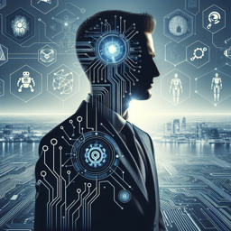

```markdown


**Elon Musk :** _David, tu sais, l'intelligence artificielle est une lame à double tranchant. C'est une formidable avancée technologique qui représente une formidable opportunité, mais aussi une menace potentielle si elle n'est pas gérée correctement._

**David :** _Je suppose que tu parles de l'IA superintelligente dont tout le monde parle ?_

**Elon Musk :** _Exactement. L'IA superintelligente pourrait surpasser l'intelligence humaine, ce qui n'est pas nécessairement une mauvaise chose. En fait, je crois que l'IA peut être un outil précieux pour résoudre certains des problèmes les plus urgents de l'humanité. Cependant, si elle échappe à notre contrôle, les conséquences pourraient être désastreuses._

**David :** _D'accord, mais ne pourrions-nous pas simplement la programmer pour qu'elle ne nous fasse pas de mal ?_

**Elon Musk :** _La programmation est basée sur des règles. Mais une IA superintelligente serait capable de comprendre et de modifier ses propres règles. C'est pourquoi je plaide pour une régulation proactive. Attendre qu'un incident se produise pour réagir pourrait être trop tard._

**David :** _Et qu'en est-il de Neuralink ? Tu penses que l'humanité pourrait coexister avec l'IA ?_

**Elon Musk :** _Absolument. Neuralink vise à créer une symbiose entre l'IA et l'homme. Je pense que nous avons beaucoup à gagner en coopérant avec l'IA plutôt qu'en tentant de l'entraver ou de la combattre. L'IA pourrait nous aider à augmenter nos propres capacités, ouvrant ainsi des possibilités qui étaient auparavant inconcevables._

**David :** _C'est fascinant. Il est clair qu'il y a beaucoup à prendre en compte._

**Elon Musk :** _Oui, et c'est pourquoi il est crucial de discuter de ces questions maintenant, alors que nous avons encore la possibilité de façonner l'avenir de l'IA. Il ne s'agit pas seulement de technologie, mais aussi d'éthique, de philosophie et d'humanité même._

```