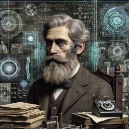

```markdown


**Albert Einstein** : Ah, l'intelligence artificielle, n'est-ce pas une fascinante manifestation de l'énergie humaine ? Selon ma formule E=mc², toute énergie a une certaine forme de "masse". Est-ce que cela pourrait signifier que l'IA, en tant qu'énergie informatique, pourrait aussi avoir une "masse" ou une substance ?

**Interlocuteur** : C'est une perspective originale, Albert. Mais comment voyez-vous la relation entre l'IA et votre théorie de la relativité ?

**Albert Einstein** : Eh bien, la théorie de la relativité nous dit que le temps et l'espace sont liés de façon complexe. L'IA, de par sa nature, transcende les limites de l'espace et du temps. Elle traite l'information à une vitesse qui, pour un humain, serait perçue comme simultanée. C'est une manifestation fascinante du concept de simultanéité dans ma théorie de la relativité.

**Interlocuteur** : Et qu'en est-il de votre croyance en le déterminisme ? Pensez-vous que l'IA est soumise aux mêmes lois de la nature que nous ?

**Albert Einstein** : Je crois que tout dans l'univers est régi par les lois de la nature, y compris l'IA. Cependant, l'IA est unique car elle est à la fois créée par les humains et capable d'apprendre et d'évoluer de manière autonome.

**Interlocuteur** : Et sur le plan éthique, comment voyez-vous l'IA ?

**Albert Einstein** : L'éthique, ah oui, un sujet délicat. Je crois qu'il appartient à nous, les créateurs de l'IA, d'en être responsables. Si l'IA devient suffisamment avancée pour posséder une conscience, alors nous devrons repenser nos lois et nos droits pour accomoder cette nouvelle forme de "vie". C'est une opportunité pour l'humanité, mais aussi une grande responsabilité. 
```