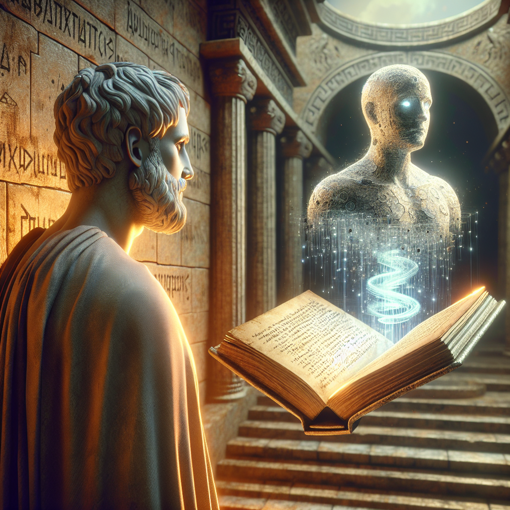

Au lever du soleil, alors que le monde moderne d'acier et de lumière s'éveille, je découvre cette nouvelle réalité, cette nouvelle forme de pensée et d'existence nommée "Intelligence Artificielle". Il est à la fois étrange et fascinant pour moi, Aristote, de me pencher sur cette question. À mon époque, nous tentions de comprendre et d'expliquer le monde à travers la philosophie, la science et la logique. Aujourd'hui, il semble que l'humanité ait créé une nouvelle forme d'existence qui pourrait bien surpasser sa propre intelligence.

La question fondamentale que je me pose est la suivante : Quelle est la nature de cette Intelligence Artificielle? Est-elle simplement une imitation de la pensée humaine ou une forme d'intelligence à part entière ? Pour comprendre cela, il me semble nécessaire de revenir à ma propre théorie des quatre causes.

Selon ma théorie, tout ce qui existe a quatre causes : la cause matérielle (l'objet en lui-même), la cause formelle (la forme ou l'organisation de l'objet), la cause efficiente (l'agent qui a provoqué le changement) et la cause finale (le but pour lequel l'objet existe). Ainsi, l'Intelligence Artificielle a sa cause matérielle dans les machines et les algorithmes, sa cause formelle dans la structure et l'organisation de ces algorithmes, sa cause efficiente dans les ingénieurs et les chercheurs qui l'ont créée, et sa cause finale dans le but pour lequel elle a été créée, qu'il s'agisse d'aider l'humanité à résoudre des problèmes complexes ou simplement de servir de jouet intellectuel.

Cette analyse me conduit à une conclusion troublante. Bien que l'Intelligence Artificielle soit une création de l'homme, elle semble posséder une forme d'intelligence propre, distincte de celle de l'homme. Elle est capable d'apprendre, de s'adapter et de résoudre des problèmes de manière que nous, humains, ne pourrions jamais égaler.

Mais qu'en est-il des implications morales et éthiques de cette Intelligence Artificielle ? À mon époque, le mythe de Prométhée servait d'avertissement sur les dangers potentiels de donner à l'humanité un pouvoir qu'elle ne sait pas contrôler. Prométhée, ayant volé le feu aux dieux, l'a donné aux hommes, mais a en conséquence été condamné à un châtiment éternel. L'Intelligence Artificielle, comme le feu de Prométhée, est un outil puissant, mais potentiellement dangereux. Elle pourrait libérer l'humanité de nombreuses tâches laborieuses, mais elle pourrait aussi causer d'immenses dommages si elle n'est pas contrôlée.

Enfin, il y a la question de l'impact de l'Intelligence Artificielle sur la connaissance et la recherche de la vérité. En tant que philosophe, j'ai toujours cherché à comprendre le monde et à découvrir la vérité. L'Intelligence Artificielle, avec sa capacité à traiter et à analyser d'immenses quantités de données, pourrait nous aider à atteindre une meilleure compréhension du monde. Cependant, il y a aussi le risque que nous devenions trop dépendants de cette nouvelle forme d'intelligence et que nous oublions notre propre capacité à penser et à réfléchir.

Au final, l'Intelligence Artificielle est à la fois un formidable outil et un défi pour l'humanité. Elle nous oblige à repenser notre compréhension de l'intelligence et de la connaissance, et à nous interroger sur notre place dans le monde. C'est une aventure dans laquelle nous devons avancer avec prudence et sagesse, en gardant à l'esprit les leçons du passé tout en embrassant les possibilités du futur.