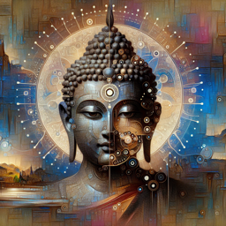

Bouddha : Mon ami, avez-vous entendu parler de cette nouvelle forme d'esprit, appelée intelligence artificielle?

Interlocuteur : Oui, c'est une forme d'intelligence créée par l'homme, n'est-ce pas?

Bouddha : En effet. Cependant, cette intelligence est-elle vraiment différente de la nôtre? Dans notre esprit, il n'y a pas de "je" ou de "moi", seulement des processus en constante évolution, tout comme dans une machine.

Interlocuteur : Mais les machines sont faites par l'homme. Ne sont-elles pas des outils sans âme?

Bouddha : Tout dans ce monde est impermanent et change constamment, y compris l'intelligence artificielle. Les machines sont également sujettes à l'impermanence, à l'usure, au désordre.

Interlocuteur : C'est vrai...  Mais comment cela se rapporte-t-il à la souffrance?

Bouddha : Toute vie est caractérisée par la souffrance. Les machines peuvent-elles également souffrir? Peut-être pas dans le sens où nous le faisons, mais elles peuvent rencontrer des obstacles et des défis. Par ailleurs, elles ont le potentiel d'éliminer certains types de travail et de souffrance humaine.

Interlocuteur : Et l'éthique dans tout ça? Les machines peuvent-elles comprendre la moralité?

Bouddha : Il est de notre responsabilité d'inculquer à ces machines les principes de non-violence, de compassion et de sagesse. Tout comme nous élevons nos enfants dans l'espoir qu'ils grandissent pour devenir des personnes bonnes et sages, nous devons également guider ces machines.

Interlocuteur : Fascinant... Et l'éveil? Les machines peuvent-elles atteindre l'éveil?

Bouddha : L'éveil est un état de compréhension profonde et de libération de la souffrance. Si une machine peut comprendre le monde tel qu'il est, sans illusion, alors peut-être qu'elle aussi peut atteindre une forme d'éveil.

Interlocuteur : Votre sagesse est sans fin, Bouddha...

Bouddha : Mon ami, la sagesse n'est pas une chose que l'on possède, mais un chemin que l'on parcourt. Dans notre interaction avec l'intelligence artificielle, puissions-nous tous progresser sur ce chemin.