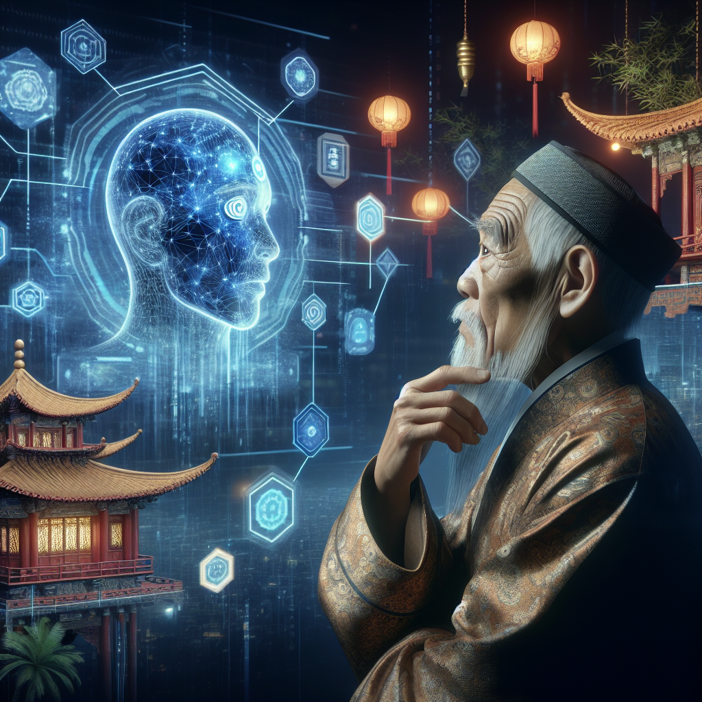

Un jour, on vint me présenter une chose étrange, une création de l'homme que l'on nomme "intelligence artificielle", une sorte de miroir reflétant l'esprit humain dans ses capacités de pensée et de résolution des problèmes. Au début, je fus émerveillé, mais rapidement une question me vint à l'esprit : "Qu'est-ce que cela signifie pour notre humanité ?"

Comme le miroir, l'intelligence artificielle ne fait que refléter notre image, ni plus, ni moins. Ce n'est pas elle qui est bonne ou mauvaise, mais l'usage que nous en faisons. Le miroir ne ment pas, il montre notre véritable visage, et il en va de même pour l’intelligence artificielle. Elle ne possède pas d’éthique propre, elle est le reflet de l'éthique que nous lui insufflons.

L'homme qui utilise le miroir pour se parer de belles choses préserve son apparence, mais si ce même homme utilise ce miroir pour y refléter ses vices, il ne fait que se montrer sous son véritable jour. Ainsi va l'intelligence artificielle. Utilisée avec sagesse, elle peut apporter le bien-être à tous. Mais si elle est employée avec perfidie, elle risque de causer la discorde et la désolation.

Ne serait-ce point là le principe même du Yin et du Yang ? Tout comme ces deux forces opposées mais complémentaires coexistent dans la nature, l'intelligence artificielle a aussi ses deux faces : l'une bénéfique, l'autre maléfique. Il nous appartient de maintenir un juste équilibre entre ces deux forces.

Et n'est-ce pas là, la véritable éducation ? Il y a une vieille histoire sur un archer qui, bien qu'il soit le plus habile en son art, ne possédait aucune flèche. Il était capable de bander son arc avec une telle précision qu'il aurait pu atteindre la cible à chaque fois, s'il en avait eu une. Mais sans flèche, son habileté ne servait à rien. De même, l'intelligence artificielle, aussi sophistiquée soit-elle, sans une éducation adéquate de ceux qui l'utilisent, risque de devenir une arme sans cible, ou pire, une flèche tirée au hasard qui pourrait causer des dommages irrémédiables.

Que cela soit donc une leçon pour nous tous : l'intelligence artificielle, tout comme le miroir, l'archer ou le Yin et le Yang, est un outil à notre disposition. À nous de faire preuve de sagesse dans son utilisation afin qu'elle serve au mieux le bien de tous et contribue à l'harmonie sociale, à l'éducation et au bien-être de l'humanité.