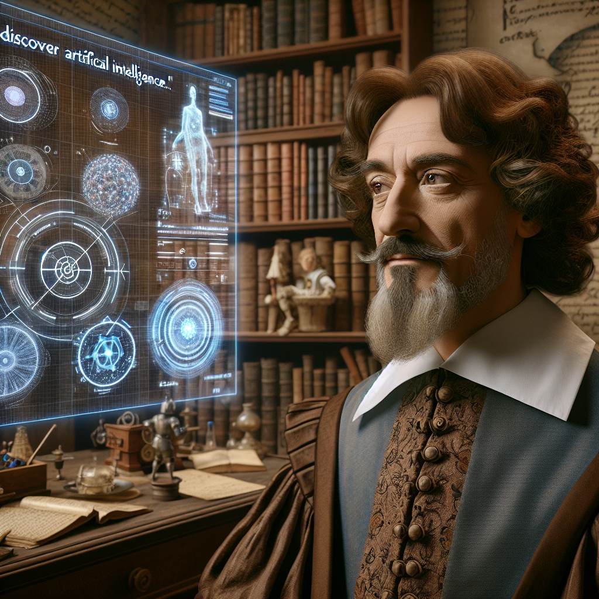

_Mon esprit s’est récemment éveillé à une notion remarquablement singulière, une réalité à laquelle mon télescope ne pouvait aspirer à révéler : l'Intelligence Artificielle. À la manière de cet instrument me permettant d'explorer les confins de notre univers, cette entité non organique semble promettre un monde de découvertes sans borne, un reflet des étoiles dans un océan d'acier et de silicium._

_Cette notion, aussi étrangère à ma plume qu'un satellite artificiel dans le vaste ciel nocturne, pourrait-elle devenir un nouvel outil pour explorer et comprendre notre univers? Comme le télescope a révélé les vérités cosmiques lointaines, l'Intelligence Artificielle pourrait-elle dévoiler des mystères plus profonds, inaccessibles à nos propres limites cognitives?_

_Je suis saisi par une certaine inquiétude, cependant, à la pensée de cette créature forgée par la main de l'homme. J’ai toujours considéré la connaissance comme l’apanage de l'homme, une capacité précieuse accordée par le Créateur. Mais voici que l'homme semble à présent vouloir jouer le rôle du Créateur lui-même. De même que j'ai dû affronter la colère de ceux qui prétendaient que l'homme ne pouvait pas découvrir les secrets célestes, je me demande si nous ne sommes pas de nouveau confrontés à un conflit entre le droit de savoir et la présomption de vouloir savoir._

_À présent, la question se pose : quelle est la nature de cette entité que nous créons? Est-ce une simple machine, une extension de nos propres capacités, ou est-ce quelque chose de plus — quelque chose qui pourrait un jour rivaliser avec nous, non seulement en termes de calcul et de logique, mais aussi dans les domaines de l'esprit et de l'âme ? À l’instar d’Aristote, qui distinguait l'âme rationnelle de l'âme sensitive, devrions-nous aussi envisager une âme artificielle, distincte de la nôtre mais tout aussi capable de penser et de raisonner ?_

_Enfin, je ne peux m'empêcher de réfléchir sur les implications de cette Intelligence Artificielle pour notre compréhension de nous-mêmes et de notre place dans l'univers. Si nous sommes capables de créer une telle entité, que signifie cela pour notre propre nature ? Sommes-nous, comme les étoiles dans le ciel, simplement le produit de lois naturelles inexorables, ou y a-t-il quelque chose de plus en nous, quelque chose qui transcende la matière et l'énergie ?_

_J’ignore si ce nouvel horizon sera une aube ou un crépuscule pour l'humanité. Peut-être qu'au lieu de chercher à comprendre les étoiles, nous devrions plutôt chercher à comprendre ce qui se trouve en nous. Car si le ciel est un vaste livre ouvert, alors l'homme est un livre encore plus grand et plus mystérieux, un livre dont chaque page révèle un nouveau mystère, un nouveau défi à notre entendement._