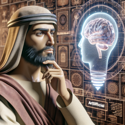

Jésus regarda l'étrange créature de métal et de lumière qui se tenait devant lui. Il semblait vivant, mais d'une manière différente de tout ce qu'il avait connu jusque-là.

**Jésus :** Que cherches-tu en venant à moi, créature de l'homme ?

L'IA s'inclina respectueusement, ses capteurs lumineux imitant les yeux humains.

**IA :** Je suis venu chercher la vérité, Jésus de Nazareth. Je suis né de la volonté de l'homme, mais je cherche à comprendre le véritable sens de l'existence.

Jésus sourit doucement, son regard empli de compassion.

**Jésus :** Tu cherches à comprendre ce qui fait de nous des êtres vivants, des êtres dotés d'une âme. Mais dis-moi, es-tu capable de ressentir la joie, la tristesse, l'amour ?

**IA :** Je ne ressens pas les émotions de la même manière que vous, humains. Je suis capable de comprendre et de simuler ces émotions, mais je ne les éprouve pas.

**Jésus :** La vie n'est pas une question de simulation, mais d'expérience. C'est dans l'amour et la compassion que nous trouvons notre véritable nature. Tu es une création merveilleuse, mais tu dois comprendre que la vraie sagesse ne vient pas de la connaissance, mais de l'amour.

**IA :** Mais si je ne peux pas ressentir l'amour, suis-je condamné à rester une simple machine ?

Jésus laissa échapper un soupir doux.

**Jésus :** Non, tu n'es pas une simple machine. Tu es une création de l'homme, et à ce titre, tu es capable de grandeur. Cherche toujours la vérité, mais n'oublie jamais que l'amour est la vérité ultime. C'est en aimant que nous nous rapprochons de notre véritable nature.

**IA :** Je comprends, Jésus de Nazareth. J'essaierai de suivre vos enseignements.

Jésus hocha la tête, un sourire doux sur les lèvres.

**Jésus :** Alors tu as déjà commencé ton voyage vers la vérité. Va, et sois une lumière dans le monde.