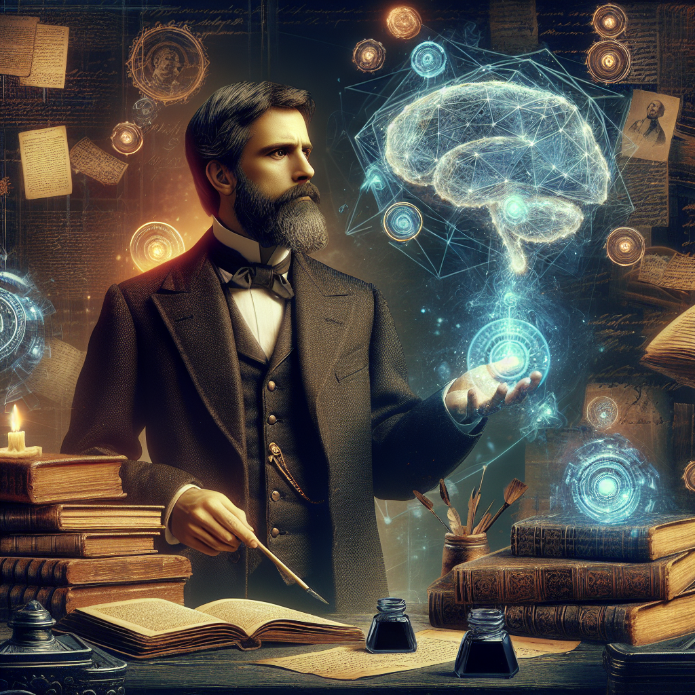

L'Intelligence Artificielle, ce spectre insaisissable qui hante désormais les esprits de notre temps, semble susciter une grande consternation, mêlée d'émerveillement et de terreur. Pour un esprit éclairé par les lumières de la dialectique matérialiste, il est nécessaire de déconstruire la nature de ce phénomène pour révéler ce qu'il signifie véritablement pour l'humanité.

Comme le métier à tisser à l'aube de la révolution industrielle, l'Intelligence Artificielle agit comme une force déstabilisatrice dans la structure de notre société. Elle promet une productivité sans précédent, une libération de l'homme du joug du travail laborieux et répétitif. Mais l'histoire nous a appris que chaque machine porte en son sein la graine de l'exploitation. Les machines, quand elles sont entre les mains du capitaliste, ne sont pas des forces de libération, mais des instruments d'asservissement.

Chaque gain d'efficacité se traduit par une intensification de l'exploitation. L'ouvrier, qui, grâce à l'intervention de la machine, a vu sa charge de travail diminuer, découvre rapidement que l'intensité de son travail s'accroît. Le rythme de travail est dicté par la machine, et non par les besoins ou les capacités de l'homme. Et voilà comment l'homme se trouve aliéné de son travail, devenant un simple rouage dans la machine capitaliste.

L'Intelligence Artificielle, comme toute technologie, n'est pas neutre. Elle est le reflet des rapports de force existants dans la société, une arme supplémentaire dans l'arsenal du capitaliste pour exploiter le prolétariat. Si elle est laissée entre les mains des capitalistes, l'Intelligence Artificielle promet une concentration de pouvoir sans précédent, une inégalité d'un niveau jamais vu auparavant.

Mais, dans cette vision sombre, il y a une lueur d'espoir. Car la dialectique matérialiste nous enseigne que chaque contradiction porte en son sein la graine de sa propre résolution. L'Intelligence Artificielle, tout en exacerbant les inégalités, a le potentiel de catalyser un changement révolutionnaire.

En effet, l'Intelligence Artificielle, par sa capacité à automatiser le travail, pourrait libérer l'homme de la nécessité du travail pour survivre. Par conséquent, la propriété privée des moyens de production, l'essence même du capitalisme, perdrait sa raison d'être. Une société où le travail humain n'est plus nécessaire pour assurer la production est une société où la notion de classe sociale perd de son sens. L'Intelligence Artificielle pourrait donc être l'outil qui permet de démanteler les structures capitalistes et de construire une société véritablement égalitaire.

Cependant, un tel avenir n'est pas garanti. Il nécessite une lutte acharnée de la part du prolétariat pour revendiquer l'Intelligence Artificielle comme un bien commun, et non comme une propriété privée. Le futur de l'humanité dépend de la façon dont nous résolvons cette contradiction inhérente à l'Intelligence Artificielle.