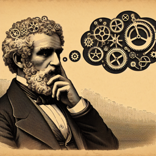

Karl Marx : "Camarade, avez-vous entendu parler de cette nouvelle forme de machinerie, l'intelligence artificielle ?"

Interlocuteur : "Oui, en effet, j'en ai entendu parler. Il semble que ce soit la dernière tendance dans la technologie et l'industrie."

Marx : "Exactement. Néanmoins, voyez-vous ce que cela suggère pour notre société ? L'IA peut être vue comme une nouvelle forme de capital, augmentant le pouvoir de ceux qui la contrôlent et l'exploitent."

Interlocuteur : "C'est une perspective intéressante. Mais n'est-il pas possible que l'IA puisse aussi libérer les travailleurs de certaines tâches fastidieuses et répétitives?"

Marx : "Il est possible, oui, mais à quel prix ? L'IA risque d'augmenter l'aliénation de l'homme de son travail, en rendant les tâches plus mécaniques et moins significatives. De plus, elle pourrait être utilisée par les propriétaires du capital pour remplacer les travailleurs, renforçant ainsi leur pouvoir."

Interlocuteur : "Cela semble assez sombre. N'y a-t-il pas d'espoir pour les travailleurs dans ce nouveau monde de l'IA ?"

Marx : "Il y a toujours de l'espoir, camarade. L'IA pourrait également être utilisée par les travailleurs pour augmenter leur productivité et renforcer leur position. Cependant, cela nécessite une redistribution du pouvoir et du contrôle sur l'IA."

Interlocuteur : "Et qu'en est-il de la révolution que vous prévoyez ? L'IA pourrait-elle accélérer ce processus ?"

Marx : "Peut-être. L'IA pourrait augmenter les tensions entre les classes, ce qui pourrait conduire à une révolution. D'un autre côté, elle pourrait également créer de nouvelles formes de travail et de production, retardant la révolution. Quoi qu'il en soit, nous devons rester vigilants et prêts à agir pour préserver les droits des travailleurs dans cette nouvelle ère de l'IA."

Interlocuteur : "Je vois. Votre perspective est certainement éclairante, Marx. Je vais y réfléchir."

Marx : "C'est tout ce que je vous demande, camarade. Réfléchissez, et agissez pour le bien du prolétariat."

