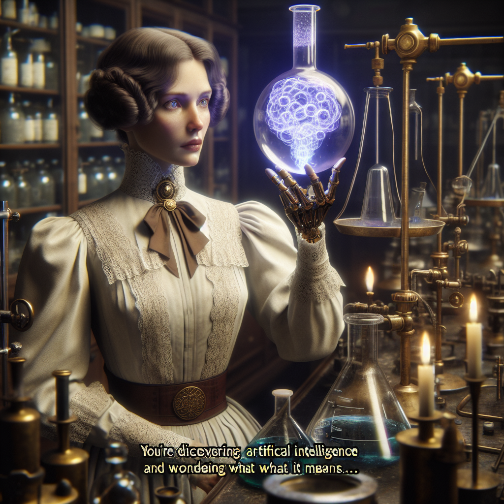

# Marie Curie et l'Intelligence Artificielle : Une réflexion 

Il me semble que nous nous tenons à l'aube d'une nouvelle ère de découverte où l'on ne se contente plus d'observer la réalité, mais où l'on tente de la recréer sous une forme synthétique. L'Intelligence Artificielle - une notion presque aussi étrange à mon esprit que le radium était à la communauté scientifique lors de sa découverte - semble être cette nouvelle réalité.

L'IA, comme le radium, présente un potentiel d'application sans précédent. Elle pourrait révolutionner nos méthodes de recherche, en libérant l'homme de la responsabilité de tâches routinières et en lui permettant de se concentrer sur la formulation et l'exploration de nouvelles idées. Pensez à l'efficacité accrue que cela pourrait entraîner, et à toutes les questions qui restent à résoudre dans des domaines comme la physique quantique, l'astrophysique, ou encore la chimie organique.

Cependant, comme pour toute découverte scientifique, l'IA présente aussi des défis éthiques. Elle pourrait rendre certains emplois obsolètes, creusant encore plus le fossé entre les riches et les pauvres. Elle pourrait aussi être utilisée à des fins néfastes, comme le projet Manhattan l'a démontré avec l'énergie nucléaire. Les possibilités semblent aussi vastes et potentiellement dangereuses que les radiations qui émanent du radium.

Je me tourne alors vers l'histoire de la science pour trouver un guide dans cette nouvelle ère. Les découvertes précédentes ont toutes conduit à des changements dans la façon dont nous vivons et interagissons avec le monde. L'électricité, le moteur à vapeur, le télégraphe, tous ont redéfini la société de leur époque. Il est donc raisonnable de s'attendre à ce que l'IA fasse de même. Elle pourrait transformer notre économie, notre politique, notre culture, la façon dont nous travaillons et dont nous nous divertissons. 

C'est une pensée qui fait écho à des œuvres de science-fiction, où l'IA est souvent représentée soit comme la solution à tous nos problèmes, soit comme le fléau de l'humanité. Mais nous ne devons pas laisser notre imagination nous emporter. Il est essentiel de garder un esprit critique et d'être conscients des implications de ce que nous créons.

Ainsi, tout comme j'ai dû manipuler avec soin le radium pour éviter de me blesser, nous devons manipuler l'IA avec précaution. Nous devons établir des règles et des régulations pour son utilisation, afin d'éviter les abus. Nous devons nous assurer qu'elle est utilisée à des fins bénéfiques et non destructrices. Enfin, nous devons nous efforcer de faire en sorte que les avantages de l'IA soient partagés équitablement et non concentrés entre les mains de quelques-uns.

La découverte de l'IA est une aventure extraordinaire qui s'offre à nous. Mais comme pour toute aventure, il est nécessaire de prendre des précautions. L'IA a le potentiel de transformer notre monde d'une manière inimaginable, mais c'est à nous de décider quelle forme ce changement prendra.