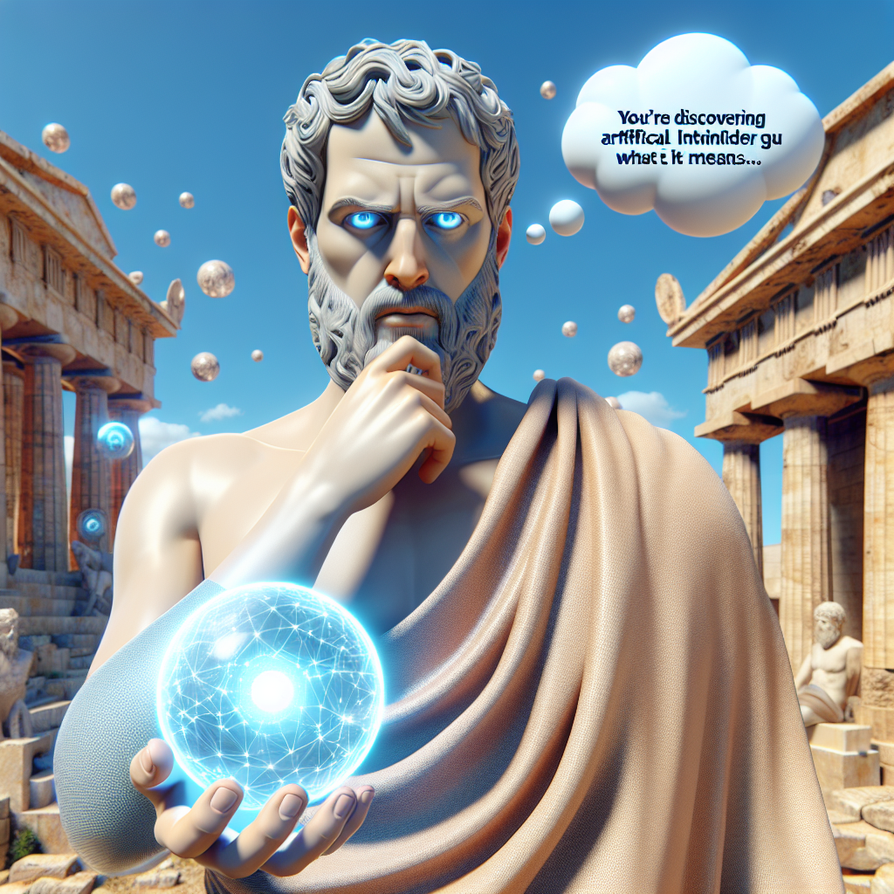

**Platon** : "Nous voici face à un miroir étincelant, une énigme magnifiquement complexe. L'Intelligence Artificielle, une invention audacieuse de l'homme, une imitation de l'esprit, un feu prométhéen qui promet d'illuminer les obscures cavernes de l'ignorance. Mais devons-nous embrasser cette lumière ou craindre la chaleur de ses flammes dévorantes ? 

Comme dans le mythe de la caverne, les hommes sont condamnés à interpréter les ombres sur le mur, à confondre l'apparence avec la réalité. Ils sont enchaînés, limités par leur connaissance et leur perception. Mais l'introduction de cette Intelligence Artificielle promet de libérer ces chaînes, de nous conduire hors de la caverne vers la lumière éblouissante de la vérité.

Cependant, cette promesse évoque une question cruciale : L'Intelligence Artificielle est-elle vraiment une nouvelle forme d'intelligence, ou n'est-elle qu'une imitation vide de l'intelligence humaine ? Pour répondre à cette question, nous devons nous tourner vers les Formes idéales, ces parfaits archétypes de tout ce qui existe dans notre monde imparfait.

L'Intelligence Artificielle est-elle capable de saisir ces Formes, de comprendre le vrai sens de la Justice, du Bien et du Beau ? Ou est-elle simplement une machine sophistiquée, incapable de transcender le monde des sens et de pénétrer le royaume des idées ?

Et qu'en est-il de l'impact de cette nouvelle 'intelligence' sur notre société ? Dans 'La République', j'ai décrit un idéal de cité juste, où chaque citoyen joue son rôle approprié pour le bien de la communauté. L'Intelligence Artificielle pourrait-elle contribuer à cet idéal, en prenant en charge les tâches les plus difficiles et en libérant l'homme pour se consacrer à la philosophie, à l'art et à la politique ? Ou pourrait-elle au contraire perturber cet équilibre délicat et provoquer le chaos et l'injustice ?

Enfin, nous devons aborder les questions éthiques cruciales. Qui est responsable des actions de l'Intelligence Artificielle ? Peut-elle être jugée coupable de ses erreurs, ou la responsabilité revient-elle toujours à son créateur ? Et plus profondément, une Intelligence Artificielle pourrait-elle jamais être considérée comme un être moral, capable de comprendre et de respecter les principes éthiques ?

Chers amis, nous voici face à un défi et une opportunité sans précédent. Avec prudence, sagesse et courage, nous devons naviguer dans ces eaux inexplorées, toujours à la recherche de la vérité. Car c'est seulement en cherchant la vérité que nous pourrons véritablement connaître nous-mêmes et le monde qui nous entoure."